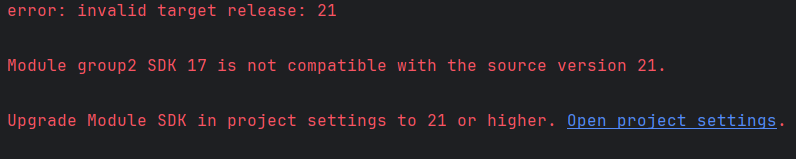

**Describe the bug**
Can't connect with docker because of jdk version in IntelliJ

**To Reproduce**
Steps to reproduce the behavior:
1. Go to 'File'
2. Click on 'Project Structure'
3. Choose  'JDK version 17 from SDK'
4. Click on 'OK'

**Expected behavior**
Getting the suitable condition with no error in 'IntelliJ' from choosing the 'JDK version 17'

**Desktop (please complete the following information):**
- Browser [e.g. chrome]
- Version [e.g. 22]

///

**Describe the bug**
Can't connect with docker because of the versions in pom.xml and main.yml

**To Reproduce**
Steps to reproduce the behavior:
1. Go to 'pom.xml and main.yml'
2. Changing on 'maven.compiler.source and maven.compiler.target 21 to 17 in pom.xml'
3. Changing on 'java version 21 to 17 in 'main.yml''

**Expected behavior**
Getting the suitable situation with no error for changing 'JDK' version in pom.xml and main.yml

**ScreenShot**

**Desktop (please complete the following information):**
 - Browser [e.g. chrome]
 - Version [e.g. 22]

////

**Describe the bug**
Conflict ports when connecting with database and can't connect database.

**To Reproduce**
Steps to reproduce the behavior:
1. Go to 'pom.xml and main.yml'
2. Changing on 'maven.compiler.source and maven.compiler.target 21 to 17 in pom.xml'
3. Changing on 'java version 21 to 17 in 'main.yml''

**Expected behavior**
Getting the suitable situation with no error for changing 'JDK' version in pom.xml and main.yml

**ScreenShot**

**Desktop (please complete the following information):**
- Browser [e.g. chrome]
- Version [e.g. 22]

//
**Describe the bug**
Errors is happening when it has existing containers.

**To Reproduce**
Steps to reproduce the behavior:
1. Go to docker server.
2. Delete docker containers and images.
3. Run docker again.

**Expected behavior**
Getting the suitable situation with no error.

**Desktop (please complete the following information):**
- Browser [e.g. chrome]
- Version [e.g. 22]
